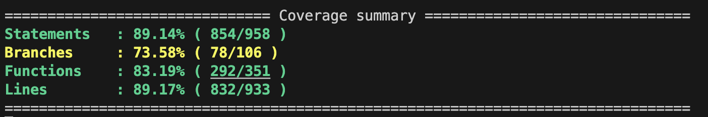

<p align="center">
  <a href="https://angular.io/docs" target="__blank"></a>
</p>

<p align="center">
  <a href="https://www.themoviedb.org/" target="__blank"></a>
</p>

# Moviedb clone

#### \* This project was generated with [Angular CLI](https://github.com/angular/angular-cli) version 14.2.9.

# Technologies used

<div style="display: flex;">
<p align="left">
  <a href="https://angular.io/docs" target="__blank"></a>
</p>

<p align="left">
  <a href="https://ngrx.io" target="__blank"></a>
</p>
</div>


# Code structure

```
app/
  ├── module/
    ├── components/
    ├── directives/
    ├── helpers/
    ├── interfaces/
    ├── pipes/
    ├── services/
    ├── store (State Management)/
    ├── tests (mock and utils for testing)/

```

# About the Project

I made this project along with a partner. We were requested to implement a clone of the movie db page <a href= 'https://www.themoviedb.org/' target="__blank">`https://www.themoviedb.org/`</a> within a time frame of two weeks, in order to get a job as Angualar developers. The app is broadly tested, implements lazy loaded modules, the state is managed via NgRx and it provides a comprenhensive showcase of my skills in technologies such as Angular, Typescript, HTML, CSS.

One feature of the code that I am particularly proud of is the NgRx one (present in the store folder of every module). becuse the state was managed throughout the whole app using Ngrx reducers, selectors, entities and effects. Moreover
we were able to successfully test those pieces of code which I consider to be among the hardest to understand, implement and test.

# Results

## Deployed website

<a href= 'https://glistening-melomakarona-1c7381.netlify.app/home' target="__blank">https://glistening-melomakarona-1c7381.netlify.app/home</a>

## Tests

- Tested Specs: 300
- Testing Results:

<p align="left">
  <a target="__blank"></a>
</p>

## App overview video

<a href= 'https://drive.google.com/file/d/1vz8FQvslvEH11MCxxSQb9yeT1nLGcolC/view?usp=sharing' target="__blank">https://drive.google.com/file/d/1vz8FQvslvEH11MCxxSQb9yeT1nLGcolC/view?usp=sharing</a>

# Clone Project and run it locally

1. Make sure you got docker-desktop installed on your pc
2. Clone the Repository

```
https://github.com/dasanchez11/the-mdb.git
```

3. Create a **.env** that has the same parameters as the **.env.example**
4. Run the app on Docker

```
docker-compose up -d
```

5. Open the app on your web browser

```
http://localhost:4200/
```

6. Enjoy
